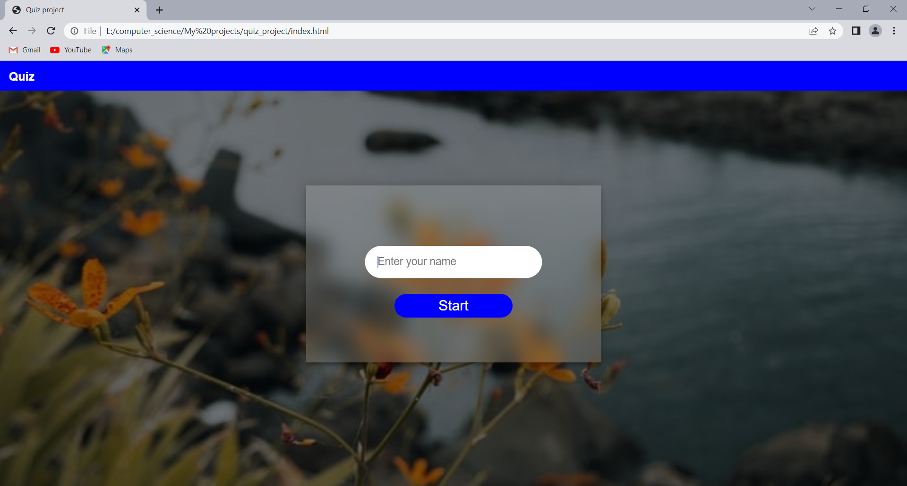
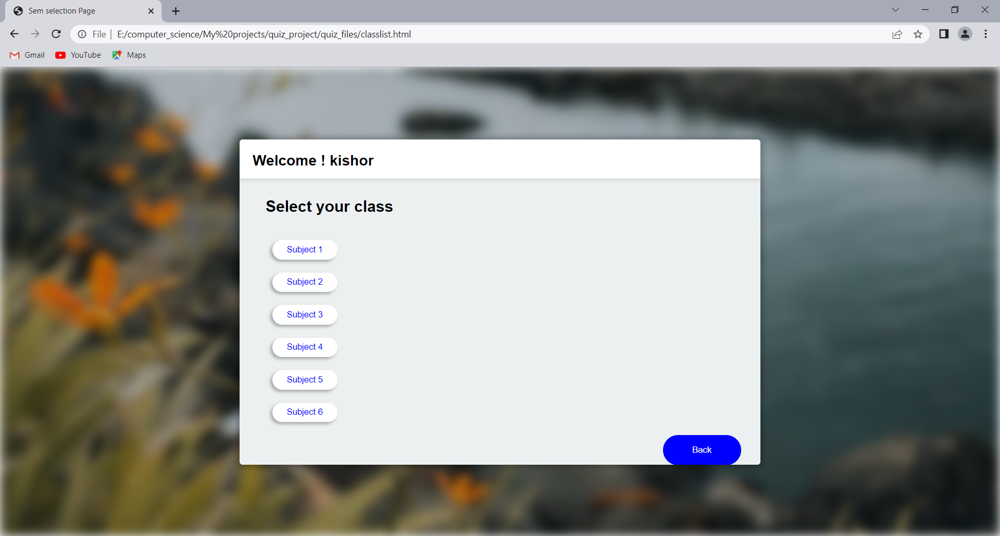
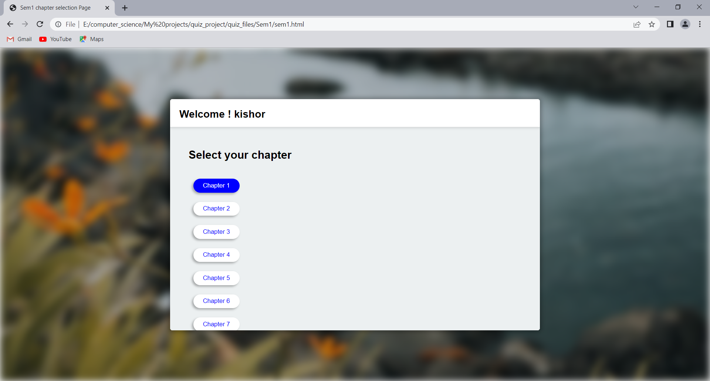
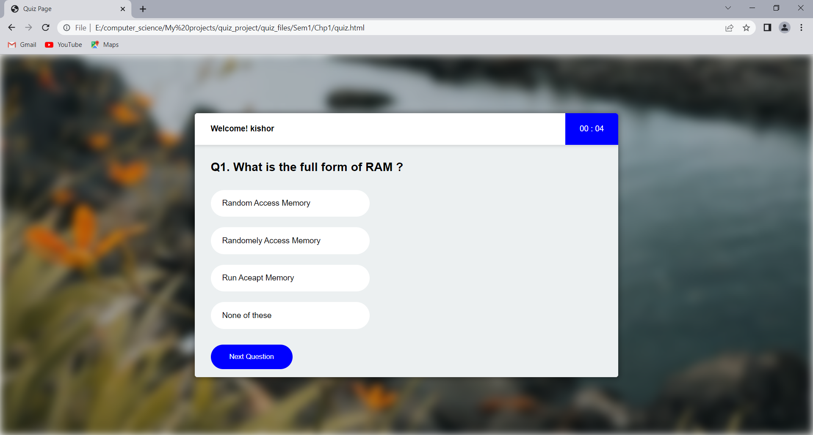
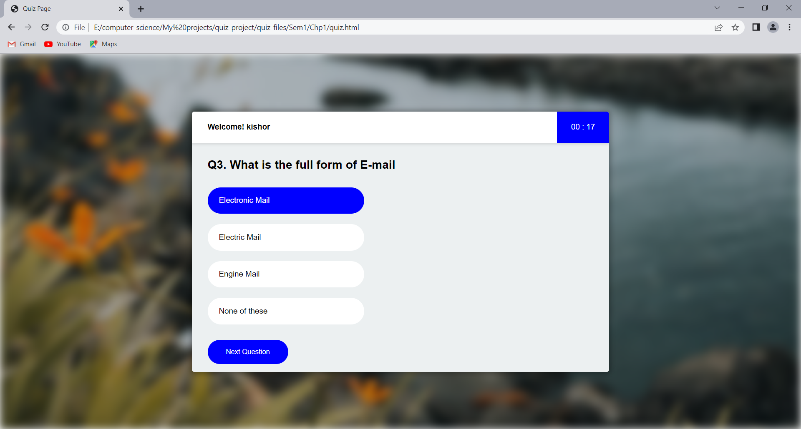
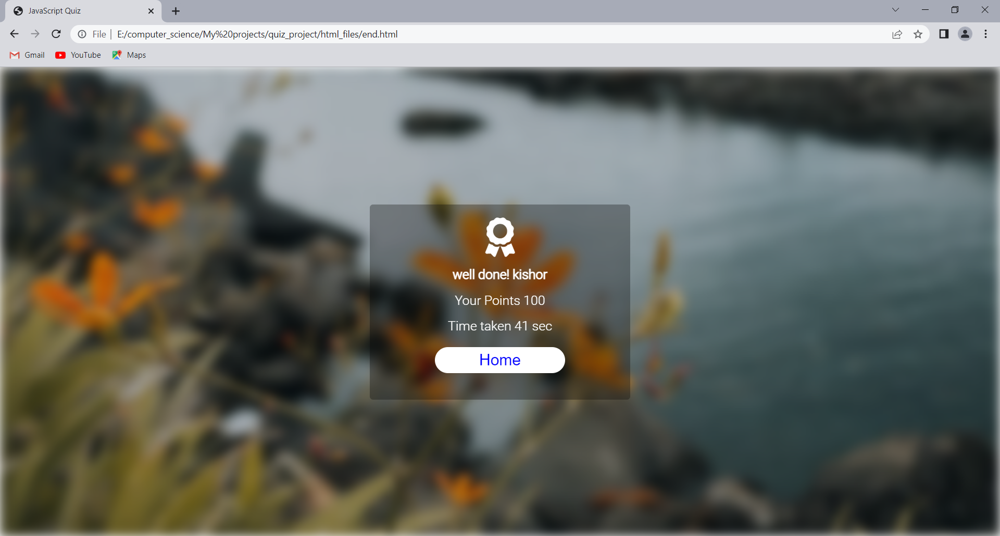

# Quiz Application

A simple quiz application built using HTML, CSS, and JavaScript. Users can select their class and chapter, enter their name, and attend a quiz. The application features a countdown timer, and users receive their results at the end of the quiz.

## Features
- **Class & Chapter Selection**: Users can select their desired class and chapter to take a quiz.
- **Username Input**: The quiz starts by asking for the user's name, which is displayed throughout the quiz.
- **Countdown Timer**: A timer runs during the quiz to limit the time for answering.
- **Result Calculation**: At the end of the quiz, users can see their final score.
- **Responsive Design**: The app adapts to various screen sizes (desktop, tablet, mobile).

## Screenshots













## Installation

### Prerequisites
- A modern web browser like Chrome, Firefox, or Edge.

### Steps
1. **Clone the repository**:
   ```bash
   git clone https://github.com/kishorgs/quiz-application.git
   ```

2. **Navigate to the project folder**:
   ```bash
   cd quiz-application
   ```

3. **Open the `index.html` file**:
   - Either open it directly in your browser, or
   - Use a tool like `Live Server` in VS Code to serve it locally.

   For example, in VS Code:
   - Install "Live Server" extension.
   - Right-click `index.html` > "Open with Live Server."

## Usage
1. Launch the application.
2. Select a class and chapter.
3. Enter your name to begin the quiz.
4. Answer the quiz questions within the time limit.
5. Submit the quiz and view your score.

## How It Works
- The user selects a class and chapter, which dynamically loads quiz questions specific to the selected chapter.
- The quiz starts with the user entering their name, which is displayed on the quiz interface.
- A countdown timer runs during the quiz. Once time runs out, the quiz is automatically submitted.
- The user's score is calculated based on the number of correct answers, and the result is shown at the end of the quiz.
